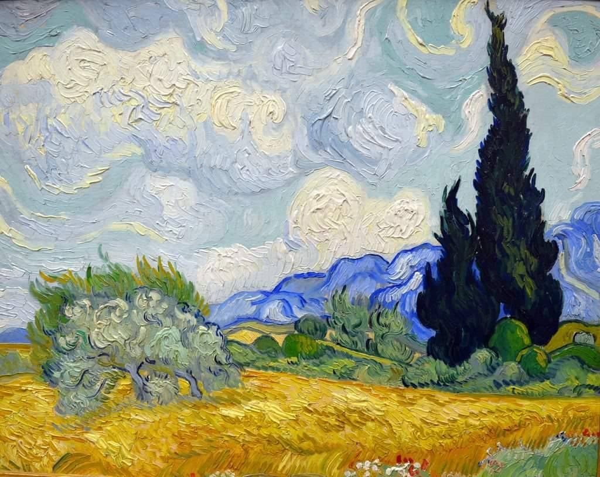
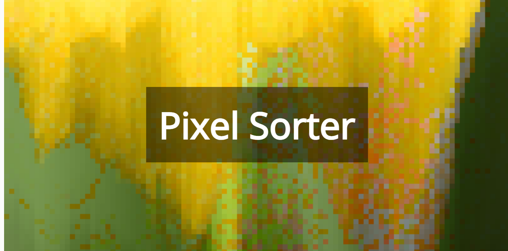

# yili0186_9103_tut6

# Week 8 Quiz - Design Research

- Part 1
  - **Van Gogh's Wheat Field is a famous work that demonstrates his unique use of texture and color in oil paint. He used swirling brushstrokes to describe the movement in the landscape, and the thickness of the brushstrokes gives the painting an almost 3D relief texture. For my project we chose Claude Monet
'Saint Georges majeur au crépuscule' is similar to this one, so I'm going to emulate Van Gogh's style and try to digitally render this drawing texture in a pixelated style. Additionally, both the wheat field and the final painting we chose use highly saturated colors to make the painting visually striking and appealing by layering bright colors. This pixelated rendering captures the essence of Van Gogh's paintings while allowing the colors and style of the work to achieve the unique possibilities of digital imaging.**




- Part 2
  - **Combining pixelation techniques with famous oil paintings preserves Van Gogh's abstraction and enhances the digital presentation. Pixelation reduces the image to discrete blocks of color, reminiscent of the texture of an oil brush stroke. By pixel-sorting individual blocks of color, we can further simulate the interaction of color and texture in Van Gogh's work. This coding technique translates the painting's vibrant hues and expressive style into a digital representation that enriches the painting's visual impact.**


[Code on an example of pixel image](https://happycoding.io/tutorials/p5js/images/pixel-sorter)


```js
function helloWorld() {
console.log("Hello, world!");
}
```

>This is a block quote

>this is
>other multiple lines

To escape formatting, use a **backslash**


